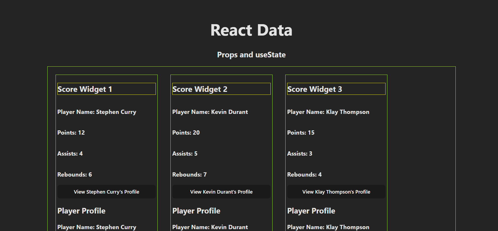
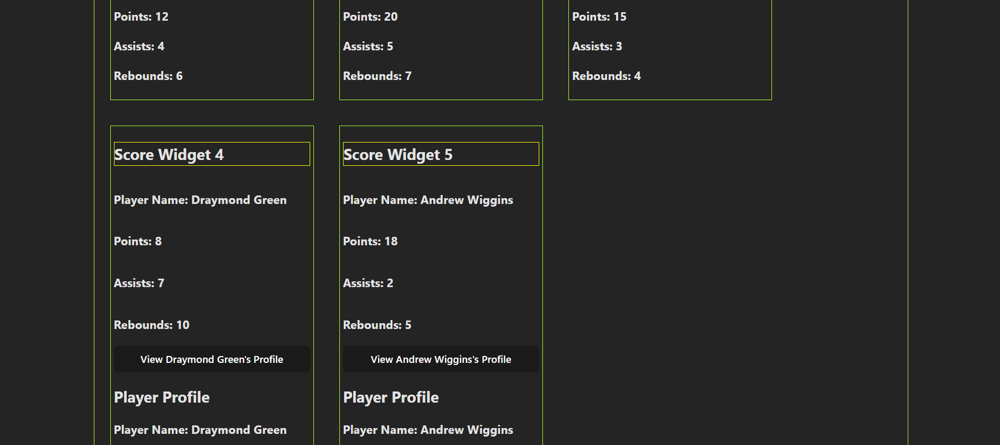
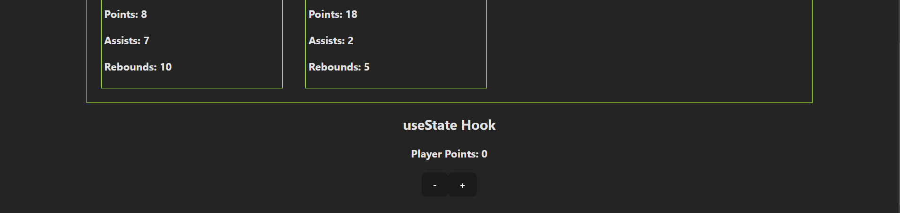

# useState hook and props  

Passing of **props** from parent component to child component  

everytime we pass a prop from the parent to the child component, 

we need to define the prop type in the child component  

**Props.propTypes = {**
     **points: Proptypes.number,**
     **playerName: Proptypes.string**
 **}**  

**useState** is a **hook** that allows you to add state to a functional component  

    // useState returns an array with 2 elements
    // the 1st eleemnt is the current state value
    // the 2nd element is a updater function that allow you to update the state value
    // the useState function takes one argumaent which is the initual state value [useState(0)]

